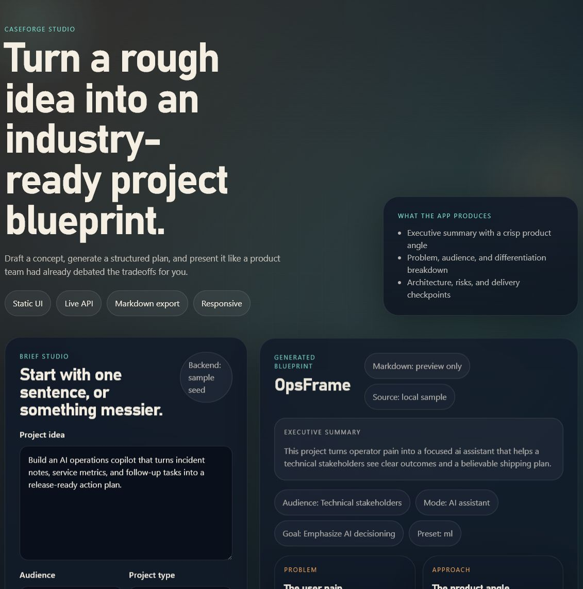

# CaseForge Studio

CaseForge Studio turns a rough product idea into an implementation-ready project blueprint through a deterministic multi-stage pipeline. It ships with a local web app, CLI, local HTTP API, persisted run history, and an optional OpenAI overlay that refines the final blueprint without becoming the only path through the product.

The core thesis is simple: a strong project idea should become explainable, scoped, reviewable, and ready for execution. CaseForge Studio helps turn vague ideas into artifacts that are easier to evaluate, compare, and improve.

## Why It Matters

- Deterministic by default, so the product remains usable without external services.
- Optional live-provider overlay for stronger AI-assisted refinement when credentials are available.
- Multiple surfaces from one shared service layer: CLI, browser UI, and HTTP API.
- Saved runs and comparison views make iteration visible instead of hand-wavy.
- Fast to evaluate in a technical review: brief in, blueprint out, compare runs, choose the strongest implementation path.

## Feature Set

- Planner, architect, evaluator, and delivery-path stages
- Markdown, JSON, and summary export under `outputs/` for persisted local runs
- Local web app with blueprint preview, saved-run browsing, and comparison
- Local HTTP API for generation, preview, retrieval, and compare flows
- Optional OpenAI Responses API overlay with deterministic fallback
- Standard-library-only backend runtime
- CI workflow plus tag-based release workflow

## Architecture Snapshot

```text
Brief
  -> normalization
  -> planner
  -> architect
  -> evaluator
  -> delivery path
  -> blueprint export
  -> optional OpenAI public-facing overlay
```

The deterministic path is the primary product path. The live provider is an enhancement layer, not a dependency for the base workflow.

## Demo Screenshot



## Quickstart

From the `caseforge-studio` project root:

```powershell
python -m pip install -e .
```

Generate a saved blueprint:

```powershell
python -m caseforge create "Build a release readiness planner that turns incident notes, service metrics, and owner comments into an action plan with risks, owners, checks, and next steps."
```

Preview a blueprint without persistence:

```powershell
python -m caseforge create "Build a release readiness planner for engineering leads." --preset full-stack --preview --json
```

Run the local web app:

```powershell
python -m caseforge serve --host 127.0.0.1 --port 8127
```

Then open `http://127.0.0.1:8127`.

Run tests:

```powershell
python -m unittest discover -s tests -v
```

Build distributable artifacts:

```powershell
python -m pip install --upgrade build
python -m build
```

## Optional OpenAI Overlay

The live provider path is optional. Without credentials, the app falls back to the deterministic path and explains why.

```powershell
$env:OPENAI_API_KEY="your-key"
$env:OPENAI_MODEL="gpt-5-mini"
python -m caseforge create "Build an AI operations copilot." --preset ml --provider openai --preview --json
```

Supported environment variables:

- `OPENAI_API_KEY`
- `OPENAI_MODEL`
- `OPENAI_BASE_URL`

See [.env.example](.env.example) for the default shape.

## CLI Commands

Create from inline text:

```powershell
python -m caseforge create "Design an operations copilot that summarizes incidents and proposes follow-up work."
```

Create from a file:

```powershell
python -m caseforge create --brief-file examples/briefs/ai-ops-copilot.md --mode "AI workflow product" --goal "Emphasize shipping discipline" --preset full-stack
```

List recent blueprints:

```powershell
python -m caseforge list
```

Open a persisted record:

```powershell
python -m caseforge show <slug>
```

## HTTP API

- `GET /health`
- `POST /api/dossiers`
- `POST /api/dossiers/preview`
- `GET /api/dossiers`
- `GET /api/dossiers/compare?slug=<slug>&slug=<slug>`
- `GET /api/dossiers/<slug>`
- `GET /`

Example request:

```json
{
  "brief": "Build an AI operations copilot that turns incident notes, service metrics, and follow-up tasks into a release-ready action plan.",
  "audience": "Technical stakeholders",
  "mode": "AI assistant",
  "goal": "Emphasize AI decisioning",
  "preset": "ml",
  "provider": "openai",
  "provider_model": "gpt-5-mini"
}
```

## Usage Flow

1. Start the web app and paste a rough project idea into the brief box.
2. Generate a blueprint and review the score, architecture section, and delivery path.
3. Open the committed sample blueprint at `examples/sample-blueprint.md` or a locally generated artifact under `outputs/<slug>/dossier.md`.
4. Compare two runs to review score movement, provider path, and recommendation changes.
5. Explain why the deterministic path is the default and when the live provider is worth using.
6. Close with the test suite and release checklist.

## Verification

- `python -m unittest discover -s tests -v`
- `python -m build`
- smoke-test `GET /health`
- smoke-test `GET /`
- generate one blueprint through the CLI
- generate one blueprint through the web UI

## Project Layout

```text
caseforge-studio/
|-- .github/
|-- caseforge/
|-- docs/
|-- examples/
|   |-- sample-blueprint.md
|   `-- briefs/
|-- tests/
|-- CHANGELOG.md
|-- RELEASE_CHECKLIST.md
`-- README.md
```

`outputs/` is generated locally at runtime and is intentionally kept out of version control. The committed public sample blueprint lives at `examples/sample-blueprint.md`.

## Release And Security

- Release gating lives in [.github/workflows/ci.yml](.github/workflows/ci.yml) and [.github/workflows/release.yml](.github/workflows/release.yml).
- Release readiness is tracked in [RELEASE_CHECKLIST.md](RELEASE_CHECKLIST.md).
- Project history is tracked in [CHANGELOG.md](CHANGELOG.md).
- Security expectations and disclosure guidance live in [SECURITY.md](SECURITY.md).

## Current Limits

- The server is local-first and single-tenant.
- There is no built-in authentication or multi-user access control.
- The OpenAI overlay path should be used only with deliberate credential handling.
- The default runtime is still a local stdlib HTTP server, not a multi-tenant hosted deployment stack.

## Next Steps

- Add a clean deployment wrapper around the local server path
- Capture one intentional live-provider blueprint artifact
- Add stronger browser-level regression coverage
- Promote the best saved blueprint flow into a tighter public release
